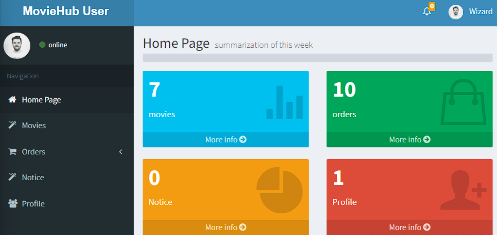
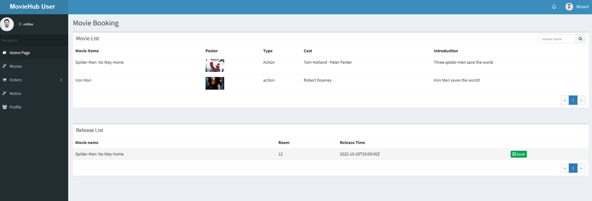
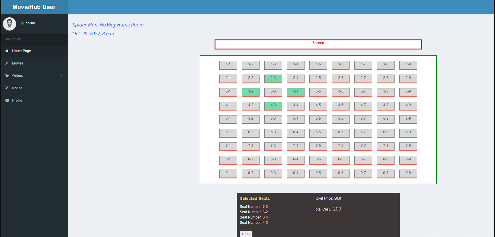
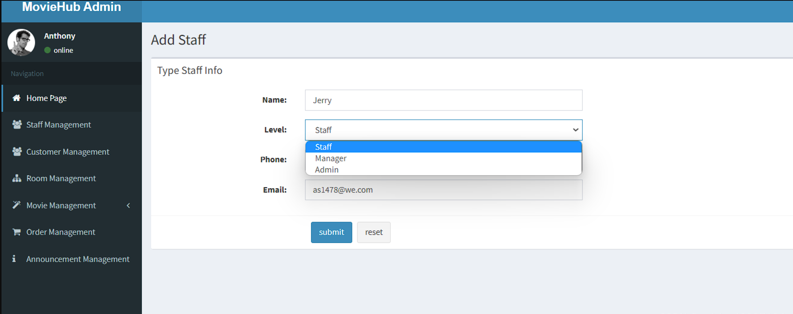
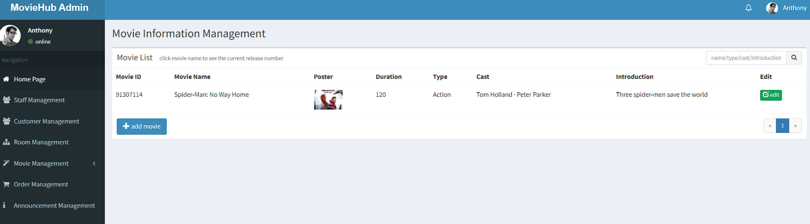
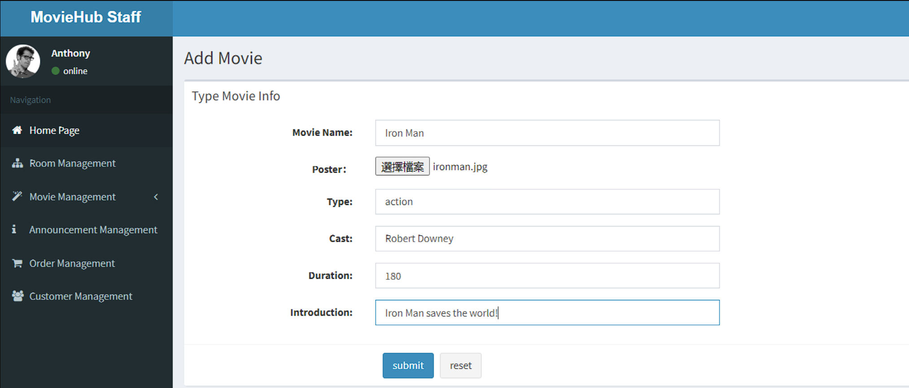
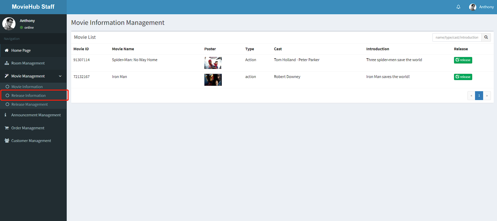
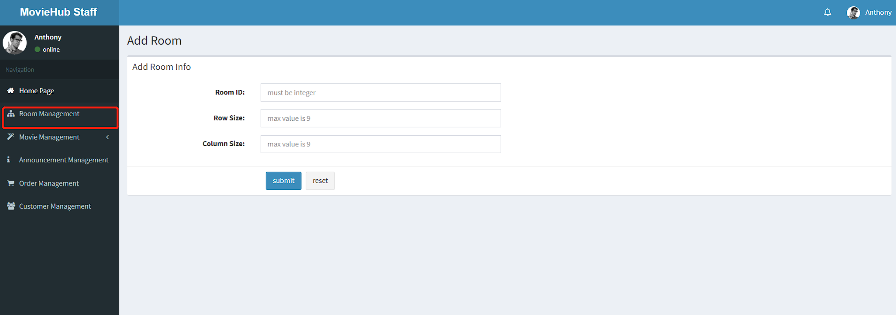
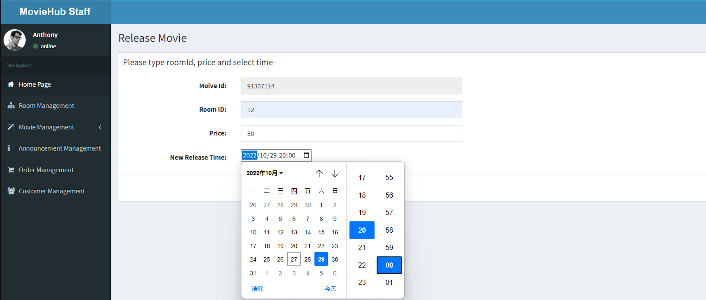
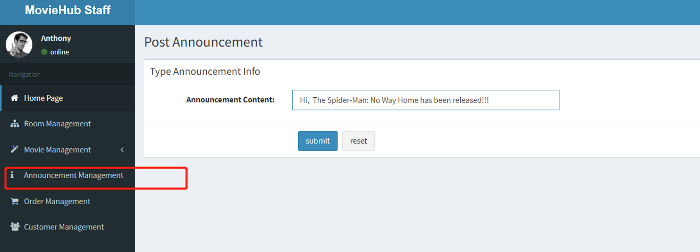

# MovieHub

This is a  booking system of Movie ticket.  This system can always provide ticket of the latest and hottest movie for you to enjoy.
You can choose to login in the system as different roles including Customer, staff and administrator in the home page.

## Login as a Customer
In the login page you can input your user name and password to login the system. If you do not have an account, you can click the register button and create your own account!!!
Then you enter the home page of Customer, where you can check the number of movies, your orders, your notification as well as Personal Profile. And on the right side of your page you, the menu bar will help to find what you want quickly.

##### Book your favorate movie
 In the movie booking page, you can find out what movies are showing and book the movie ticket. Click the "book" button and then choose the seat. 

You can reserve up to four seats at a time. Be sure that you have **bind your bank account** in your Profile page before you pay the bill. And you can check the order in Order History.

## Login as an administrator
##### Insert a staff
As an administrator, you can not only check the staff list but can also insert new staff in your system.
 
The system will automatically create the staff account number and password. Please remember them, and the staff can change the password in Profile. 
##### Insert a movie
In the page of movie information Manangement you can find out what movie are showing and add new movie.

You just need to need input the basic information including the name, duration, cast and so on, and then you can insert a new movie. **Be careful: The maximum duration is 3 hours.**

## Login as a Staff
As a staff, you can insert movie.

##### Release a new movie
In the release information page you can release a new session.
Before that, you need to **create a new room**. In the Room management page, you can insert the room id and room size, and then insert a new room.
To release a new movie, just insert the movie name, room ID, price and release time.  **Be careful: Release Time cannot be previous time.  There can be no other films in the three hours before and three hours after the release of the film**

##### Post an Announcement 
To inform your clients the latest release or other information, you can post an announcement. This announcement will be sent to all clients.

 
  
You can also check the list of the staff and orders, however as a staff, you do not have right to modify them.

##  How to run
##### Create table in your database.
Firstly in settings.py check the database name and the password, change that to your password and account. 
There are two way to init the database. 
The first way is: running the sql code in sql file.  
The second way is:  
<kbd>python manage.py makemigrations</kbd>  
<kbd>python manage.py migrate </kbd>

###### Install Dependency
Please ensure that you has install python3 and have upated your pip to the latest version.

<kbd>pip install django</kbd>  
<kbd>pip install pymysql</kbd>  
<kbd>pip install PIL</kbd>  
<kbd>pip install pillow</kbd>  

##### Running code
Run  <kbd>python manage.py migrate</kbd> in your terminal.<kbd>cmd</kbd> 

## Contributing

## Current contributors
- Renjie He
- Dong Tan
- Victor Guo
- Wizard Cheng
- Peddy Zong

If you would like to make improvements to the project, please contact us for permission to contribute. Feel free to dive in!
